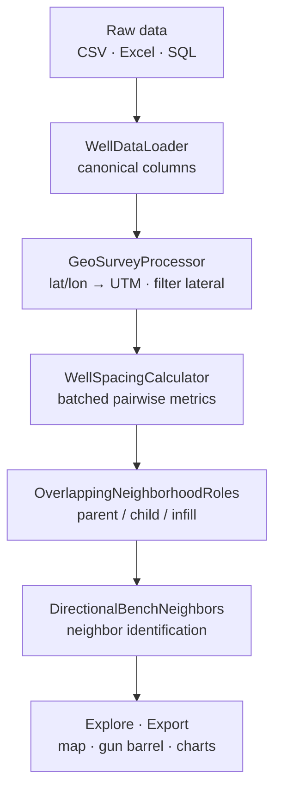

<div align="center">

# 🛢️ Well Spacing Analyzer

**Parent/child well-spacing analytics for unconventional reservoirs — from raw surveys to an interactive map, in minutes**

[](https://www.python.org/)
[](https://dash.plotly.com/)
[](tests/)
[](LICENSE.txt)


**Compute pairwise spacing for ~20,000 horizontal wells in under 15 minutes** — horizontal/vertical/3D
distances, lateral overlap, alignment class, parent/child roles, and neighbor identification —
then explore it all in a browser. No Spotfire license. No notebooks required.

</div>

<!--
  📸 HERO SCREENSHOT
  Drop a GIF/PNG of the dashboard (map + gun barrel + production-by-role) at docs/img/hero.png
  and uncomment the line below. A single hero image does more than three paragraphs here.

<p align="center"></p>
-->

---

## Why this exists

Well spacing drives capital efficiency in unconventional development: drill too close and child
wells get depleted and frac-hit by their parents; drill too far and you leave reserves behind.
Quantifying it across thousands of wells means heavy geospatial math on directional surveys — work
that used to live in brittle Spotfire dashboards and one-off scripts.

**Well Spacing Analyzer turns that into a single tool.** A reservoir engineer uploads their data,
maps columns once, clicks **Calculate**, and gets an interactive analysis: well trajectories on a
map, gun-barrel cross-sections, parent/child relationships, and production-by-role comparisons.

---

## ✨ Highlights

| | |
|---|---|
| 🗺️ **Interactive map** | Well trajectories + bottom-holes on a Leaflet basemap. Color by bench / role / operator / vintage, draw neighborhood edges, measure distances. |
| 📐 **Gun barrel diagrams** | Cross-sectional TVD vs. horizontal position with spacing zig-zag annotations — the industry-standard spacing view. |
| 👪 **Parent / child roles** | `OverlappingNeighborhoodRoles` (V2) labels every well **parent / child / infill_candidate** from spacing pairs + completion dates, without the chaining artifacts of hard clustering. |
| 📊 **Production by role** | Box plots of 180/365-day cumulative oil/gas/water **per lateral foot**, grouped by role — does spacing actually cost you barrels? |
| ⚡ **Built for scale** | Batched pairwise computation (200k pairs/batch) with checkpoint/resume. ~20,000 wells in < 15 min. |
| 🔌 **Any data source** | CSV, Excel, or live SQL (Postgres, MySQL, SQL Server, Databricks, Snowflake, Oracle, SQLite). Map any column naming convention to canonical names in the UI. |

---

## 📸 Screenshots

<!--
  Add captioned screenshots to docs/img/ and uncomment. Suggested gallery:
  | Map view | Gun barrel | Production by role |
  |---|---|---|
  |  |  |  |
-->

> _Screenshots coming soon — run `python run_dashboard.py` to see the live app._

---

## 🚀 Quickstart

```bash
# 1. Clone
git clone https://github.com/apoorvasaxena03/well-spacing-analyzer.git
cd well-spacing-analyzer

# 2. Set up a virtual environment
python -m venv venv
source venv/bin/activate          # Windows: venv\Scripts\activate

# 3. Install
pip install -r requirements.txt

# 4. Launch the dashboard
python run_dashboard.py           # add --debug for verbose logging
```

Then open the app in your browser and follow the guided flow:

```text
Upload  →  Map Columns  →  Configure  →  Calculate  →  Explore  →  Export
```

Header, directional-survey, and production files are mapped to canonical column names inside the
app, so **any naming convention works** — pick a template or let fuzzy-matching suggest the mapping.

---

## 🔬 How it works



The `src/` library is the unchanged engine; the dashboard is a thin layer that calls the same
classes the notebooks use — so power users and layman users get identical results.

<details>
<summary><b>The interesting engineering</b> (alignment classification &amp; parent/child roles)</summary>

<br/>

**Alignment-aware spacing.** Every pair is classified by the angle between wellbores, and a
different algorithm computes spacing for each regime:

| Class | Angle | Method |
|-------|-------|--------|
| Parallel-like | ≤ 25° | Crossline \|Δy(x)\| sampled over the lateral-overlap band |
| Oblique | 25–65° | Nearest-projection from i-samples onto the k-polyline |
| Perpendicular | ≥ 65° | Same nearest-projection, 3D-aware |

**Overlapping neighborhoods, not clusters.** Each well gets its _own_ local view of who's nearby.
Neighborhoods overlap (well C can be in both A's and E's) — deliberately avoiding the _chaining_
problem of DBSCAN-style clustering, where a string of wells collapses into one blob. The **nearest
older eligible neighbor** (by completion date) becomes the parent; counts of older neighbors decide
parent vs. child vs. infill.

See [`.claude/docs/algorithms.md`](.claude/docs/algorithms.md) for the full derivation.

</details>

<details>
<summary><b>Library usage</b> (for notebooks / power users)</summary>

<br/>

```python
from src.well_data.well_data_manager import WellDataLoader, GeoSurveyProcessor
from src.well_data.well_spacing_stats import WellSpacingCalculator
from src.well_data.well_role_assignment import OverlappingNeighborhoodRoles

# Column maps are always {"Your Source Column": "canonical_name"}
loader = WellDataLoader()
header_df = loader.get_header_data(source="header.csv", column_map=header_map)
dir_df    = loader.get_directional_data(source="survey.csv", column_map=survey_map)

geo = GeoSurveyProcessor()                 # WGS84 → UTM, configurable zone
dir_df = geo.compute_utm_coordinates(dir_df)
dir_df = geo.filter_after_heel_point(dir_df)   # laterals only

calc = WellSpacingCalculator(...)
df_spacing = calc._calculate_spacing_statistics(batch_size=200_000, max_distance_miles=4.0)

roles = OverlappingNeighborhoodRoles().assign_roles(df_spacing, header_df)
```

`notebooks/RingEnergy/well_spacing_RingEnergy_v2.ipynb` is the reference end-to-end run.

</details>

---

## 🧰 Tech stack

**App:** Dash · Plotly · dash-leaflet · dash-bootstrap-components · Flask-Caching · diskcache
**Engine:** pandas · NumPy · SciPy · GeoPandas · Shapely · pyproj · scikit-learn · HDBSCAN
**Data:** SQLAlchemy + connectors (Databricks, Snowflake, ODBC, …) · openpyxl · rapidfuzz

---

## 🗂️ Project structure

```text
├── src/                    # Core library (the engine)
│   ├── utils/              #   logging · multi-DB manager · data wrangling
│   └── well_data/          #   loading + UTM · spacing engine · role assignment
├── dashboard/              # Dash app — the 6-step guided workflow
├── notebooks/              # Reference runs / integration checks
├── tests/                  # pytest suite (unit + integration)
├── .claude/docs/           # Architecture, algorithms, data-format references
└── run_dashboard.py        # Dashboard launcher
```

---

## ✅ Tests

```bash
pytest                      # 146 tests across tests/unit + tests/integration
```

---

## 🛣️ Roadmap

**Built:** guided dashboard (upload → export), interactive map, gun barrel, parent/child role
assignment, on-demand neighbor/avg-spacing/WPS diagnostics, production-by-role analytics, session
import/export.

**Planned:** parent-child network graph · spacing-vs-production scatter · type-curve builder ·
frac-hit risk heatmap · infill opportunity finder. See
[`.claude/docs/dashboard-roadmap.md`](.claude/docs/dashboard-roadmap.md).

---

## 📄 License

© 2024–2025 Apoorva Saxena. Shared for **viewing purposes only** — redistribution, modification, or
commercial use is prohibited without written permission. See [LICENSE.txt](LICENSE.txt).

## 👤 Author

**Apoorva Saxena** — Reservoir Engineer
[LinkedIn](https://www.linkedin.com/in/apoorvasaxena) · [GitHub](https://github.com/apoorvasaxena03)
